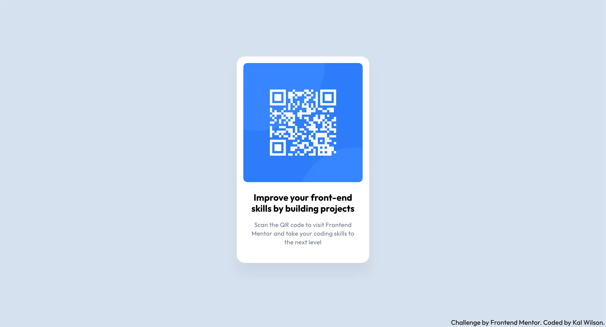

# Frontend Mentor - QR code component solution

This is a solution to the [QR code component challenge on Frontend Mentor](https://www.frontendmentor.io/challenges/qr-code-component-iux_sIO_H). Frontend Mentor challenges help you improve your coding skills by building realistic projects.

## Table of contents

- [Overview](#overview)
  - [Screenshot](#screenshot)
  - [Links](#links)
- [My process](#my-process)
  - [Built with](#built-with)
  - [What I learned](#what-i-learned)
  - [Continued development](#continued-development)
  - [Useful resources](#useful-resources)
- [Author](#author)

## Overview

### Screenshot

Desktop view:

Mobile view:

### Links

- Solution URL: [QR Code Component repo](https://github.com/kalwilson/fem-qr-code)
- Live Site URL: [Add live site URL here](https://kalwilson.github.io/fem-qr-code/)

## My process

### Built with

- Semantic HTML5 markup
- CSS custom properties
- Flexbox
- Mobile-first workflow

### What I learned

- Practiced structuring semantic vanilla HTML5 for clarity
- Used CSS custom properties to maintain consistent theming, and simplify any future updates.
- Reviewed how to center elements perfectly using flexbox in a responsive, mobile-first layout.
- Started to get comfortable deploying projects on GitHub Pages with proper relative paths for assets.

### Continued development

- Currently building frontend skills through Frontend Mentor challenges to gain real-world project experience.
- Studying to earn the Junior JavaScript Developer certificate from [certificates.dev](https://certificates.dev).
- Planning to learn Python via the University of Helsinki’s free [Python MOOC](https://python.mooc.fi).
- Aiming to deepen knowledge of frontend frameworks and improve development workflows with Git, testing, and deployment.
- Committed to continuous learning and practical application to grow as a well-rounded developer.

### Useful resources

- [Frontend Mentor Documentation](https://www.frontendmentor.io/docs) – Clear challenge requirements and best practices.
- [CSS-Tricks: A Complete Guide to Flexbox](https://css-tricks.com/snippets/css/a-guide-to-flexbox/) – Fantastic for understanding Flexbox layout.
- [MDN Web Docs: Using CSS Custom Properties](https://developer.mozilla.org/en-US/docs/Web/CSS/Using_CSS_custom_properties) – Great resource for theming.

## Author

- GitHub - [Kal Wilson](https://github.com/kalwilson)
- Frontend Mentor - [@kalwilson](https://www.frontendmentor.io/profile/kalwilson)
- LinkedIn - [Kal Wilson](https://www.linkedin.com/in/kalwilson)
